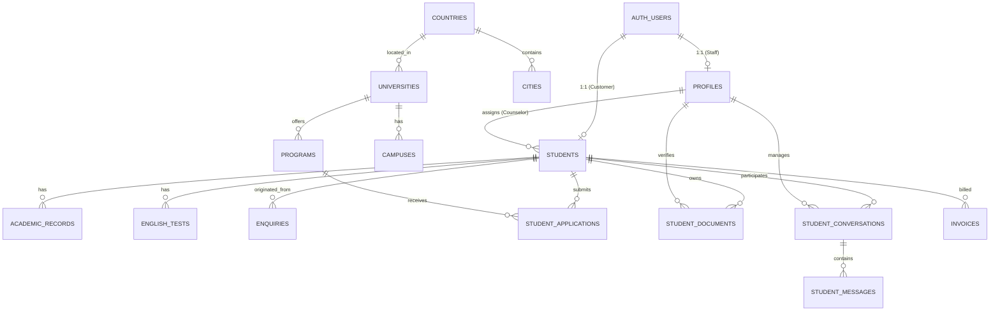

# Entity Relationship Diagram (ERD)

```mermaid
erDiagram
    AUTH_USERS ||--o| PROFILES : "1:1 (Staff)"
    AUTH_USERS ||--o| STUDENTS : "1:1 (Customer)"

    PROFILES ||--o{ STUDENTS : "assigns (Counselor)"
    
    STUDENTS ||--o{ ACADEMIC_RECORDS : has
    STUDENTS ||--o{ ENGLISH_TESTS : has
    STUDENTS ||--o{ ENQUIRIES : originated_from
    
    COUNTRIES ||--o{ CITIES : contains
    COUNTRIES ||--o{ UNIVERSITIES : located_in
    UNIVERSITIES ||--o{ CAMPUSES : has
    UNIVERSITIES ||--o{ PROGRAMS : offers
    
    STUDENTS ||--o{ STUDENT_APPLICATIONS : submits
    PROGRAMS ||--o{ STUDENT_APPLICATIONS : receives
    
    STUDENTS ||--o{ STUDENT_DOCUMENTS : owns
    PROFILES ||--o{ STUDENT_DOCUMENTS : verifies
    
    STUDENTS ||--o{ STUDENT_CONVERSATIONS : participates
    PROFILES ||--o{ STUDENT_CONVERSATIONS : manages
    STUDENT_CONVERSATIONS ||--o{ STUDENT_MESSAGES : contains
    
    STUDENTS ||--o{ INVOICES : billed
```
